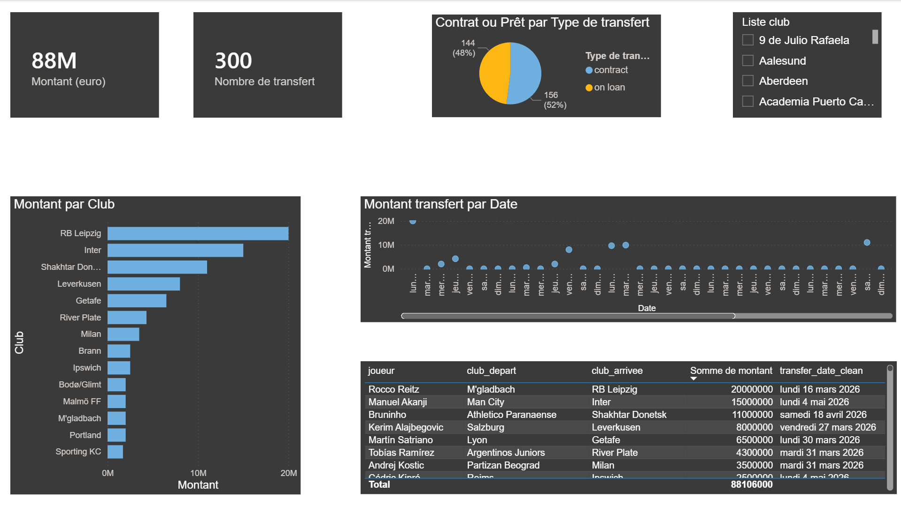

# ⚽ Football Data Pipeline (ELT)

Ce projet illustre la mise en place d'une **Modern Data Stack** complète pour extraire, transformer et analyser des données de transferts de football. Il transforme des données brutes issues d'une API en une **Table de Faits** structurée et prête pour la Business Intelligence.

## 🚀 Vue d'Ensemble
L'objectif est de démontrer une maîtrise du cycle de vie de la donnée :
1. **Extraction** : Données brutes de transferts chargées dans BigQuery.
2. **Chargement** : Orchestration via Docker pour garantir la portabilité.
3. **Transformation** : Utilisation de **dbt** pour le nettoyage et la modélisation SQL.
4. **Visualisation** : Dashboard interactif pour le suivi du marché des transferts.

## 🏗️ Architecture des Données
Le pipeline suit une architecture de médaillon simplifiée :
- **Staging (`stg_football_transfers`)** : Nettoyage, renommage des colonnes et typage initial.
- **Marts (`fct_transfer_analysis`)** : Couche finale de reporting. Gestion des formats de dates ISO complexes (`YYYY-MM-DDTHH:MM:SSZ`) convertis en formats `DATE` et `TIMESTAMP` exploitables.

## 🛠️ Stack Technique
- **Data Warehouse** : Google BigQuery
- **Transformation** : dbt (Data Build Tool)
- **Environnement** : Docker & Docker Compose
- **Langages** : SQL (GoogleSQL), YAML, Python

## 📂 Structure du Projet
```text
├── dbt/
│   ├── models/
│   │   ├── staging/      # Nettoyage et normalisation
│   │   └── marts/        # Tables de faits prêtes pour le BI
│   ├── dbt_project.yml   # Configuration du projet dbt
│   └── sources.yml       # Définition des sources BigQuery
├── docker-compose.yml    # Orchestration du container dbt
├── Dockerfile            # Image personnalisée dbt-bigquery
└── README.md             # Documentation

⚙️ Installation et Utilisation
Pré-requis
Docker installé sur votre machine.

Un projet Google Cloud avec un accès à BigQuery.

Un fichier profiles.yml configuré pour dbt.

Lancement du pipeline
Clonez le dépôt :

Bash
git clone [https://github.com/Alexis45140/football-data-pipeline.git](https://github.com/Alexis45140/football-data-pipeline.git)
Exécutez les transformations avec Docker :

Bash
docker compose run --rm dbt run


## 📊 Dashboard
Le modèle de données final alimente un dashboard permettant d'analyser :
- Le volume total des transferts par saison.
- Les clubs les plus actifs sur le marché.
- La précision temporelle des transactions (timestamping).



## 🧠 Défis Techniques Résolus
- **Data Quality** : Résolution de problèmes de formatage de dates via `SAFE.PARSE_TIMESTAMP` pour éviter les échecs de pipeline.
- **Conteneurisation** : Mise en place d'un environnement Docker pour assurer la reproductibilité des builds SQL indépendamment de la machine locale.
