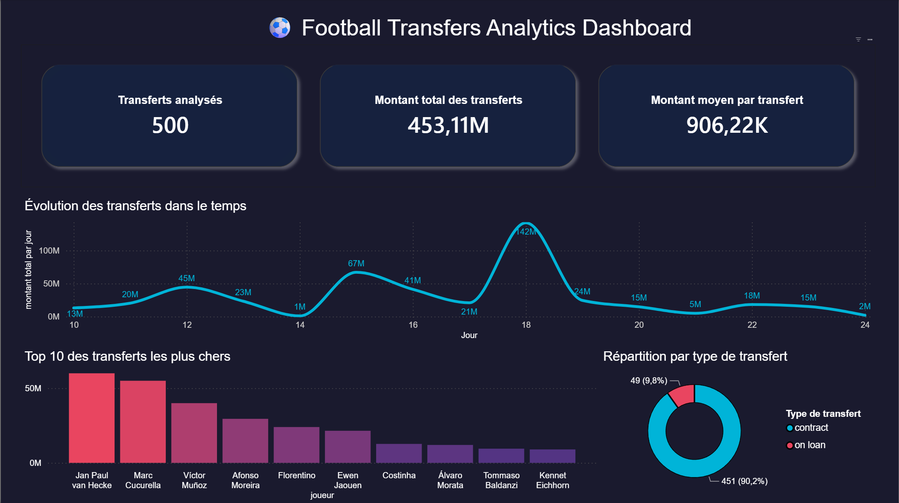

# ⚽ Pipeline Data ELT — Football Transfers Analytics (Python × BigQuery × dbt Core × Docker)

Ce dépôt héberge un projet de **Modern Data Stack** conteneurisé, simulant un environnement de production pour un **Analytics Engineer / Data Engineer**. L'objectif est d'extraire en temps réel les données de transferts de football via une API, de les charger dans **BigQuery**, de les transformer avec **dbt Core**, et de restituer les résultats dans un **dashboard Power BI**.

---

## 🏗️ Architecture Globale du Pipeline (ELT)

```
API Football (RapidAPI)
        ↓
   Extraction Python (conteneur Docker dédié)
        ↓
   BigQuery — seed (chargement brut)
        ↓
   dbt Core — Staging (stg_football_transfers)
        ↓
   dbt Core — Marts (fct_transfer_analysis)
        ↓
   Power BI (Dashboard interactif)
```

Le pipeline suit une approche **ELT** moderne, entièrement conteneurisée :

1. **Extract** — Récupération des transferts de joueurs via l'API RapidAPI (pagination multi-pages)
2. **Load** — Chargement du CSV brut dans BigQuery via `dbt seed`
3. **Transform (Staging)** — Nettoyage, typage et conversion des dates en `TIMESTAMP`
4. **Transform (Marts)** — Modélisation orientée analyse des transferts
5. **Conteneurisation** — Deux services Docker indépendants : extraction et transformation

---

## 🛠️ Stack Technique

| Outil | Rôle |
|---|---|
| **Python (requests, pandas)** | Extraction API et structuration des données |
| **RapidAPI — Free API Live Football Data** | Source de données transferts |
| **Google BigQuery** | Cloud Data Warehouse — stockage et calcul |
| **dbt Core v1.11** | Transformation SQL modulaire — staging et marts |
| **Docker & Docker Compose** | Conteneurisation des étapes extraction et transformation |
| **Power BI** | Visualisation et dashboard interactif |
| **Git & GitHub** | Versioning |

---

## 📂 Structure du Projet

```
football-data-pipeline/
├── README.md
├── dbt_project.yml
├── requirements.txt
├── Dockerfile
├── docker-compose.yml
├── profiles.yml.example
├── images/
│   └── football_dashboard_preview.png
├── seeds/
│   └── transferts_football.csv
├── scripts/
│   └── extract_transfers.py
└── models/
    ├── staging/
    │   ├── sources.yml
    │   └── stg_football_transfers.sql
    └── marts/
        └── fct_transfer_analysis.sql
```

---

## 🧬 Détail du Pipeline

### 1. Extraction — `scripts/extract_transfers.py`

Récupère les transferts de joueurs sur plusieurs pages via l'API RapidAPI, structure les données (joueur, club de départ, club d'arrivée, montant, date, type de transfert) et génère un CSV consommé ensuite par dbt.

```python
def extract_top_transfers(total_pages=3):
    url = "https://free-api-live-football-data.p.rapidapi.com/football-get-all-transfers"
    all_transfers = []

    for page in range(1, total_pages + 1):
        response = requests.get(url, headers=headers, params={"page": str(page)})
        if response.status_code == 200:
            data = response.json()
            transfers = data.get('response', {}).get('transfers', [])
            for t in transfers:
                fee_data = t.get('fee', {})
                fee_value = fee_data.get('value', 0) if isinstance(fee_data, dict) else 0
                record = {
                    "joueur": t.get('name'),
                    "club_depart": t.get('fromClub'),
                    "club_arrivee": t.get('toClub'),
                    "montant": fee_value,
                    "date_transfert": t.get('transferDate'),
                    "type_transfert": t.get('transferType', {}).get('text', 'N/A')
                }
                all_transfers.append(record)

    df = pd.DataFrame(all_transfers)
    df.to_csv("seeds/transferts_football.csv", index=False, encoding='utf-8-sig')
```

🔐 La clé API est gérée via une variable d'environnement (`.env`, jamais commitée).

---

### 2. Couche Staging — `stg_football_transfers.sql` (Vue)

Isole la donnée brute, type proprement les colonnes — notamment la conversion de la date ISO (avec timezone) en véritable `TIMESTAMP` BigQuery.

```sql
{{ config(materialized='view') }}

WITH source AS (
    SELECT * FROM {{ ref('transferts_football') }}
),

renamed AS (
    SELECT
        joueur,
        club_depart,
        club_arrivee,
        CAST(montant AS FLOAT64) AS montant,
        PARSE_TIMESTAMP('%Y-%m-%dT%H:%M:%SZ', date_transfert) AS date_transfert,
        type_transfert
    FROM source
)

SELECT * FROM renamed
```

---

### 3. Couche Marts — `fct_transfer_analysis.sql` (Table)

Table de faits orientée analyse des transferts, prête pour la restitution BI.

```sql
{{ config(materialized='table') }}

SELECT
    joueur,
    club_depart,
    club_arrivee,
    montant,
    date_transfert,
    type_transfert
FROM {{ ref('stg_football_transfers') }}
```

---

## 🐳 Conteneurisation — 2 services Docker indépendants

```yaml
services:
  extract:
    build: .
    entrypoint: ["python", "scripts/extract_transfers.py"]
    volumes:
      - .:/usr/app
    env_file:
      - .env

  dbt:
    build: .
    volumes:
      - .:/usr/app
      - ./profiles.yml:/root/.dbt/profiles.yml
    environment:
      - GOOGLE_APPLICATION_CREDENTIALS=/usr/app/credentials.json
```

🎯 Le service `extract` gère uniquement la récupération des données API. Le service `dbt` gère uniquement la transformation. Les deux partagent la même image de base mais s'exécutent indépendamment.

---

## 📊 Dashboard Power BI

Le mart `fct_transfer_analysis` alimente un dashboard Power BI comprenant :

- **Suivi des derniers transferts** — joueur, club de départ, club d'arrivée
- **Analyse des montants** — répartition par type de transfert
- **Filtres dynamiques** — par club, par période



> *Le fichier `.pbix` étant local, une version publique (Tableau Public ou Power BI Service) sera ajoutée prochainement.*

---

## 🚀 Guide d'Exécution Locale (Docker)

### Prérequis

- Docker Desktop installé et lancé
- Compte GCP avec un projet BigQuery + clé de service JSON
- Clé API RapidAPI (Free API Live Football Data)

### Configuration

1. Copier `profiles.yml.example` en `profiles.yml` et renseigner vos informations BigQuery
2. Créer un fichier `.env` à la racine avec votre clé API :
```
RAPIDAPI_KEY=votre_cle_api
```
3. Placer votre clé de service GCP sous `credentials.json`

### Déploiement

```powershell
# 1. Build des images Docker
docker-compose build

# 2. Extraction des données depuis l'API
docker-compose run extract

# 3. Chargement du CSV dans BigQuery
docker-compose run dbt seed

# 4. Exécution des modèles de transformation
docker-compose run dbt run

# 5. Nettoyage des conteneurs
docker-compose down --remove-orphans
```

---

## 👤 Auteur

**Alexis Claudeon** — Data Analyst | Analytics Engineer Junior

- 🐙 [GitHub](https://github.com/Alexis45140)
- 💼 [LinkedIn](https://www.linkedin.com/in/alexis-claudeon)