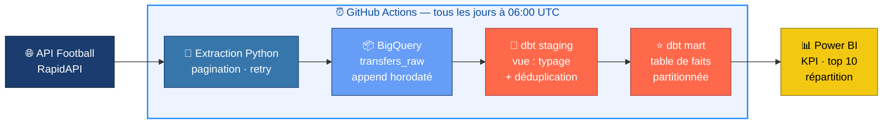

<div align="center">

# ⚽ Football Transfers — pipeline ELT

**Des transferts de football, d'une API jusqu'à un dashboard Power BI — sans une seule commande lancée à la main.**

[](https://github.com/Alexis45140/football-data-pipeline/actions/workflows/pipeline.yml)
[](https://github.com/Alexis45140/football-data-pipeline/actions/workflows/ci.yml)


</div>


---

## En 30 secondes

| | |
|---|---|
| **Ce que ça fait** | Extrait les transferts de football depuis une API, les charge dans BigQuery, les transforme avec dbt et les restitue dans Power BI |
| **Ce qui le déclenche** | Un workflow GitHub Actions, tous les jours à 06:00 UTC |
| **Ce qu'on voit** | 500 transferts, 453,11 M€ cumulés, 906,22 K€ en moyenne, 451 contrats définitifs pour 49 prêts |
| **Ce qui le protège** | 10 tests dbt qui arrêtent le run avant le dashboard, un lint et une validation du graphe dbt sur chaque PR |
| **Ce qu'il ne fait pas** | Pas de `merge` incrémental, pas d'historique au-delà de 60 jours — [et c'est assumé](#limites-connues) |

---

## Architecture


```mermaid
flowchart LR
    A["🌐 API Football<br/>RapidAPI"]

    subgraph orch ["⏰ GitHub Actions — tous les jours à 06:00 UTC"]
        direction LR
        B["🐍 Extraction Python<br/>pagination · retry"]
        C["📦 BigQuery<br/>transfers_raw<br/>append horodaté"]
        D["🔧 dbt staging<br/>vue : typage<br/>+ déduplication"]
        E["⭐ dbt mart<br/>table de faits<br/>partitionnée"]
        B --> C --> D --> E
    end

    F["📊 Power BI<br/>KPI · top 10<br/>répartition"]

    A --> B
    E --> F

    style A fill:#1a3c6e,stroke:#0d1f38,color:#fff
    style B fill:#3776AB,stroke:#1a3c6e,color:#fff
    style C fill:#669DF6,stroke:#1a3c6e,color:#fff
    style D fill:#FF694B,stroke:#a33,color:#fff
    style E fill:#FF694B,stroke:#a33,color:#fff
    style F fill:#F2C811,stroke:#8a7100,color:#000
    style orch fill:#eef4ff,stroke:#2088FF,stroke-width:2px,color:#0b4da2
```

**Pourquoi ELT et pas ETL ?** On charge le brut tel quel, on transforme ensuite dans l'entrepôt. `transfers_raw` n'est jamais écrasée : chaque run y ajoute un lot horodaté. C'est elle qui porte l'historique ; tout ce que dbt construit au-dessus est recalculable à tout moment, donc jetable sans risque.

---

## Stack

| Outil | Rôle |
|---|---|
| **Python 3.11** — requests, pandas, google-cloud-bigquery | Extraction de l'API et chargement dans l'entrepôt |
| **RapidAPI** — Free API Live Football Data | Source des transferts |
| **Google BigQuery** | Entrepôt de données |
| **dbt Core 1.12** | Transformations SQL, tests, documentation |
| **GitHub Actions** | Orchestration planifiée et intégration continue |
| **Docker & Docker Compose** | Exécution locale reproductible |
| **Power BI** | Restitution |

---

## Le pipeline, étape par étape

### 1. Extraction — `scripts/extract_transfers.py`

Parcourt les pages de l'API, met les champs à plat, dédoublonne le lot, puis écrit **directement** dans BigQuery. Pas de CSV intermédiaire : rien à committer entre deux runs.

Trois décisions qui comptent pour un run planifié, que personne ne surveille :

- les appels **rejouent sur 429 et 5xx** avec un backoff exponentiel, trois tentatives ;
- le script **sort en code 1** si rien n'est récupéré — sans quoi un run vide passerait pour un succès ;
- le chargement est un **append partitionné** sur `_extracted_at`, jamais un écrasement.

<details>
<summary>Voir le chargement BigQuery</summary>

```python
job_config = bigquery.LoadJobConfig(
    schema=RAW_SCHEMA,
    write_disposition=bigquery.WriteDisposition.WRITE_APPEND,
    time_partitioning=bigquery.TimePartitioning(field="_extracted_at"),
)
job = client.load_table_from_json(df.to_dict("records"), table_id, job_config=job_config)
job.result()
```

</details>

### 2. Staging — `stg_football_transfers` *(vue)*

Type les colonnes, construit une clé `transfer_id` et dédoublonne. **C'est la pièce centrale :** l'API renvoie une fenêtre glissante, donc le même transfert revient à chaque run.

> Sur les trois premiers runs, **1 048 lignes brutes accumulées se sont réduites à 499 transferts uniques** dans le mart.

<details>
<summary>Voir la déduplication</summary>

```sql
deduplicated as (
    select * except (rn)
    from (
        select *, row_number() over (
            partition by transfer_id order by _extracted_at desc
        ) as rn
        from typed
    )
    where rn = 1
)
```

`safe.parse_timestamp` plutôt que `parse_timestamp` : une date hors format laisse un `null` au lieu de faire tomber le run entier.

</details>

### 3. Mart — `fct_transfer_analysis` *(table)*

Table de faits consommée par Power BI, **partitionnée par mois** sur `date_transfert` et **clusterisée** sur `type_transfert`.

<details>
<summary>Voir la configuration</summary>

```sql
{{ config(
    materialized='table',
    partition_by={'field': 'date_transfert', 'data_type': 'timestamp', 'granularity': 'month'},
    cluster_by=['type_transfert']
) }}
```

Elle est reconstruite à chaque run depuis l'intégralité de `transfers_raw`. L'accumulation se joue donc en amont, dans la couche brute, pas dans le mart — voir *[Limites connues](#limites-connues)*.

</details>

### 4. Tests

Dix tests dbt sur les deux couches, plus un seuil de fraîcheur sur la source.

| Couche | Ce qui est vérifié |
|---|---|
| `stg_football_transfers` | `transfer_id` unique et non nul · joueur, montant et type de transfert non nuls |
| `fct_transfer_analysis` | `transfer_id` unique et non nul · montant non nul et jamais négatif · type de transfert non nul |
| Source `transfers_raw` | Fraîcheur : alerte au-delà de 26 h, échec au-delà de 72 h |

`dbt build` enchaîne modèles et tests dans l'ordre du graphe et **s'arrête au premier échec**. Un changement de schéma côté API casse le run au lieu de se propager silencieusement jusqu'au dashboard.

---

## Orchestration

Deux workflows, aucun serveur à maintenir.

| Workflow | Déclencheur | Ce qu'il fait |
|---|---|---|
| **`pipeline.yml`** | Tous les jours à 06:00 UTC, ou à la demande | Authentification GCP → extraction → `dbt deps && dbt build` → publication des artefacts `target/` (dont `run_results.json` et la documentation dbt) pendant 14 jours |
| **`ci.yml`** | Chaque pull request, chaque push sur `main` | `ruff` sur le Python, `dbt parse` sur les modèles |

Un garde `concurrency` empêche deux runs d'écrire en même temps dans la table brute. Et `dbt parse` valide la syntaxe et la cohérence du graphe **sans se connecter à BigQuery** : la CI tourne donc sans le moindre credential.

<details>
<summary>Secrets attendus et gestion des credentials</summary>

Dans *Settings → Secrets and variables → Actions* :

| Secret | Contenu |
|---|---|
| `RAPIDAPI_KEY` | Clé RapidAPI |
| `GCP_PROJECT` | ID du projet Google Cloud |
| `GCP_SA_KEY` | JSON complet du compte de service |

En CI, aucun fichier de credentials n'existe sur disque : le profil dbt lit la clé depuis l'environnement.

```yaml
prod:
  type: bigquery
  method: service-account-json
  project: "{{ env_var('GCP_PROJECT') }}"
  keyfile_json: "{{ env_var('GCP_SA_KEY') | as_native }}"
```

</details>

---

## Limites connues

> [!NOTE]
> Le projet tourne sur un **bac à sable BigQuery** — un projet GCP sans compte de facturation. Deux contraintes en découlent, assumées.

- **Pas de DML.** `INSERT`, `UPDATE`, `DELETE` et `MERGE` sont refusés. Le mart est donc reconstruit par `CREATE TABLE AS SELECT` au lieu d'un `merge` incrémental. À ce volume la différence de coût est nulle ; elle deviendrait significative à partir de quelques millions de lignes, où l'incrémental s'imposerait.
- **Rétention de 60 jours.** Toute table du sandbox expire au bout de 60 jours. L'historique accumulé est donc une fenêtre glissante de 60 jours, pas un historique complet.

Activer la facturation lève les deux limites d'un coup, sans quitter le free tier (1 Tio de requêtes et 10 Gio de stockage gratuits par mois). À ce volume, la facture resterait à zéro.

Le rafraîchissement Power BI reste par ailleurs manuel tant que le rapport est un `.pbix` local.

---

## Dashboard

Le mart alimente un rapport Power BI : trois KPI (nombre de transferts, montant total, montant moyen), l'évolution des montants dans le temps, le top 10 des transferts les plus chers, la répartition entre contrats définitifs et prêts, et des filtres par type et par club.

La capture d'écran en haut de cette page correspond à une extraction de **500 transferts**, pour **453,11 M€** cumulés.

---

## Exécution locale

**Prérequis :** Docker Desktop · un projet GCP avec BigQuery et une clé de compte de service · une clé RapidAPI.

**Configuration** — ces trois fichiers sont ignorés par git :

1. Copier `profiles.yml.example` en `profiles.yml`, renseigner le projet et le dataset
2. Copier `.env.example` en `.env`, renseigner la clé API et le projet GCP
3. Placer la clé de compte de service sous `credentials.json`

**Lancement :**

```powershell
docker-compose build
docker-compose run extract          # API -> transfers_raw
docker-compose run dbt deps
docker-compose run dbt build        # modèles + tests
docker-compose down --remove-orphans
```

Pour vérifier l'extraction sans rien écrire dans BigQuery :

```powershell
docker-compose run --entrypoint python extract scripts/extract_transfers.py --pages 1 --dry-run
```

---

## Structure

```
football-data-pipeline/
├── .github/workflows/
│   ├── pipeline.yml            # run quotidien : extraction + dbt build
│   └── ci.yml                  # ruff + dbt parse sur chaque PR
├── models/
│   ├── staging/
│   │   ├── sources.yml
│   │   ├── schema.yml
│   │   └── stg_football_transfers.sql
│   └── marts/
│       ├── schema.yml
│       └── fct_transfer_analysis.sql
├── scripts/
│   └── extract_transfers.py
├── data/
│   └── sample_transferts.csv   # échantillon, hors pipeline
├── images/
├── dbt_project.yml
├── packages.yml
├── profiles.yml.example
├── .env.example
├── requirements.txt
├── Dockerfile
└── docker-compose.yml
```

---

<div align="center">

### Alexis Claudeon
**Data Analyst | Analytics Engineer junior**

[](https://github.com/Alexis45140)
[](https://www.linkedin.com/in/alexis-claudeon)

</div>
